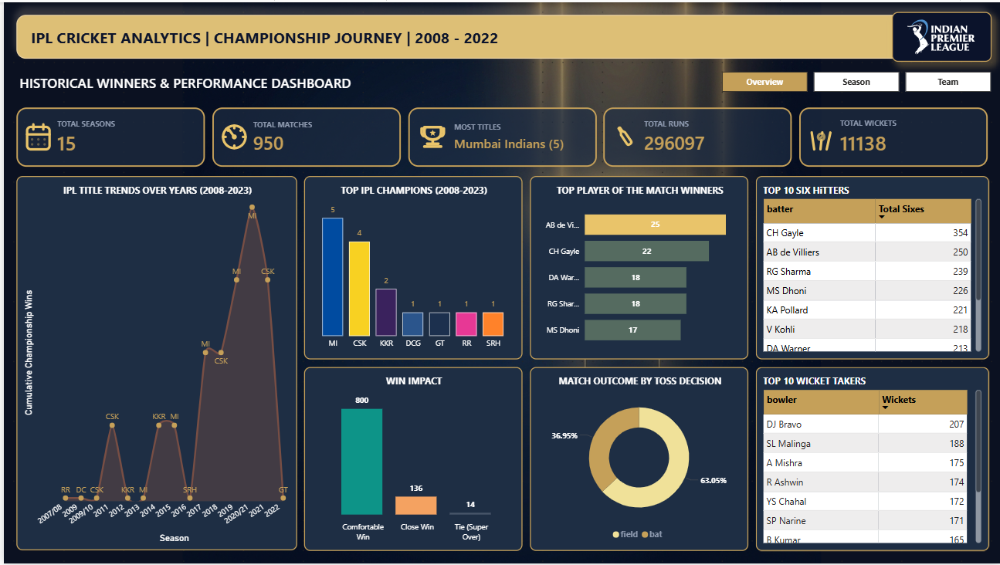
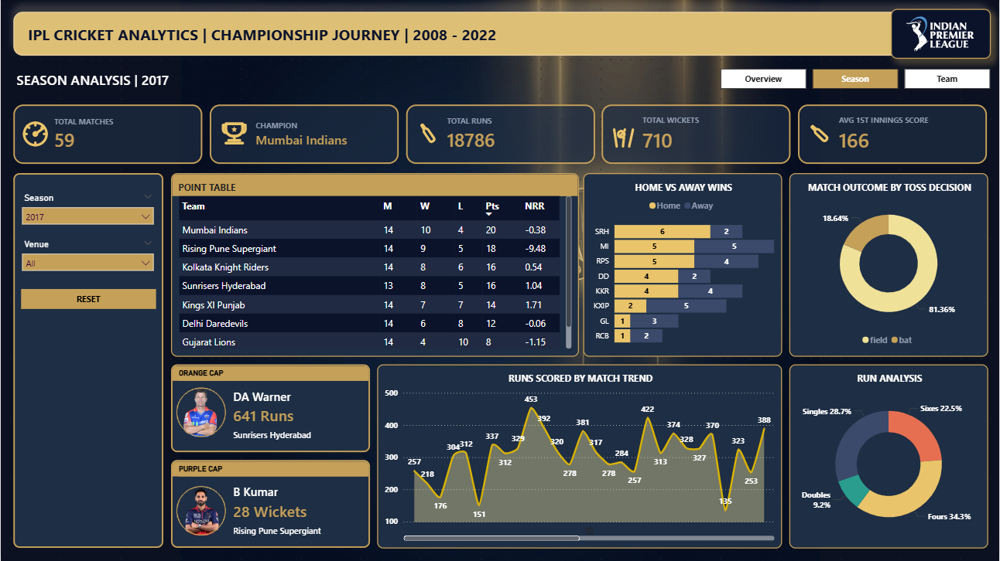
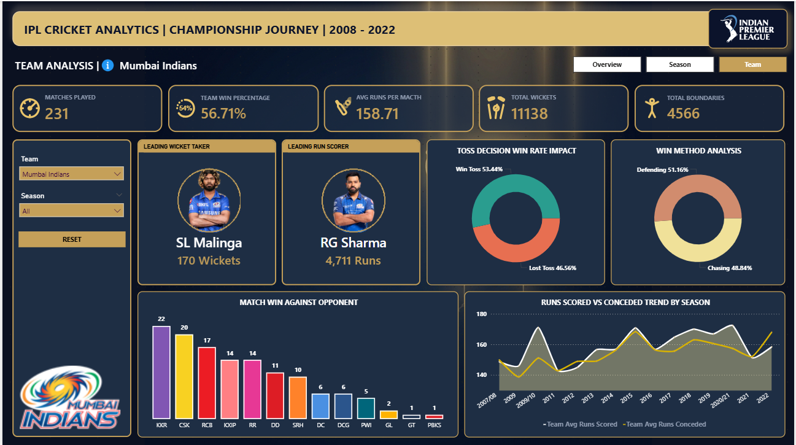

# IPL Cricket Analytics Dashboard — Power BI

An interactive Power BI dashboard covering 15 seasons of IPL cricket (2008–2022): 950 matches, 296,000+ runs, and full ball-by-ball data.



---

## Dashboard Pages

| Page                        | Description                                                               |
| --------------------------- | ------------------------------------------------------------------------- |
| **IPL Championship Trends** | Win rates, titles, and team performance across 2008–2022                  |
| **Season Spotlight**        | Deep-dive into the 2017 season — top batsmen, bowlers, and match outcomes |
| **Team Explorer**           | Filterable team performance metrics                                       |

---

## Key Insights

- **Mumbai Indians** hold the highest win rate and most titles across 15 seasons
- **Toss winners field 60%+** of the time — data confirms the instinct
- **Home advantage is real** — home teams win significantly more often
- **2017 standouts**: DA Warner (641 runs), B Kumar (26 wickets)

---

## Tech Stack

- **Power BI Desktop** — report design and publishing
- **DAX** — measures and calculated columns
- **Power Query** — data cleaning and transformation
- **Data modeling** — relationships, slicers, drill-through filters

---

## Data Sources

| File                                  | Description                                |
| ------------------------------------- | ------------------------------------------ |
| `data/IPL_Ball_by_Ball_2008_2022.csv` | Ball-by-ball delivery data for all matches |
| `data/IPL_Matches_2008_2022.csv`      | Match-level results and metadata           |
| `data/ipl_team_details_v2.xlsx`       | Team information                           |
| `data/players_details.xlsx`           | Player profiles                            |

---

## Files

```
ipl.pbix                          # Power BI report file
data/                             # Raw datasets
Overview.png                      # Dashboard overview screenshot
Season.png                        # Season Spotlight screenshot
Team.png                          # Team & Player page screenshot
IPL_dashboard.mp4                 # Dashboard walkthrough video
IPL_Project_Presentation.pptx    # Project presentation slides
```

---

## How to Open

1. Install [Power BI Desktop](https://powerbi.microsoft.com/desktop/) (free)
2. Clone or download this repository
3. Open `ipl.pbix` in Power BI Desktop
4. Data is embedded — no additional setup needed

---

## Screenshots

| Overview                  | Season Spotlight      | Team & Player     |
| ------------------------- | --------------------- | ----------------- |
|  |  |  |

---

## Credits

Built as a first Power BI project at **Luminar Technolab**, under the guidance of **Rakesh O V Sir**.

---

## Author

**Geo George**  
[LinkedIn](https://www.linkedin.com/in/geo-george-joseph) · [Email](mailto:geogeorgejoseph.work@gmail.com)
